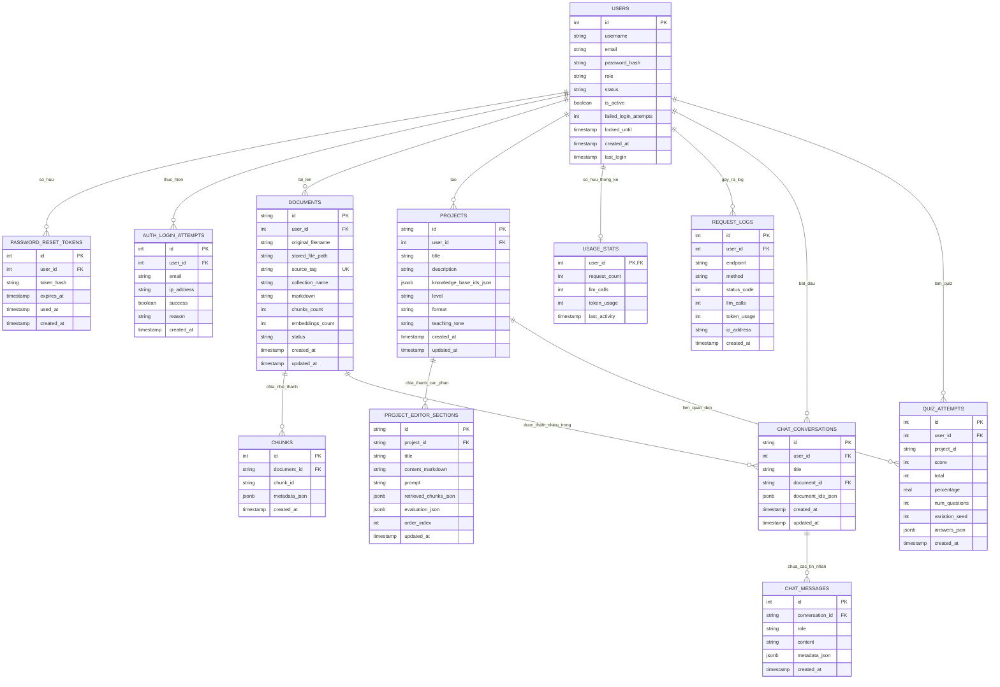

# TÀI LIỆU THIẾT KẾ CƠ SỞ DỮ LIỆU, MÔ HÌNH ERD VÀ USE CASE (BỔ SUNG KHÓA LUẬN)

Tài liệu này cung cấp thiết kế chi tiết về hệ thống cơ sở dữ liệu (Database Schema), sơ đồ quan hệ thực thể (ERD) và sơ đồ ca sử dụng (Use Case Diagram) của hệ thống **Hỗ trợ Thiết kế Bài giảng Thông minh (AI RAG Teaching Material)**.

---

## 1. Mô Hình Ca Sử Dụng (Use Case Model)

Hệ thống có hai tác nhân chính (Actors):
*   **Người dùng (User / Giáo viên / Học sinh):** Thực hiện tải tài liệu, biên soạn tài liệu giảng dạy, trò chuyện hỏi đáp, sinh câu hỏi trắc nghiệm (Quiz), tạo slide bài giảng, theo dõi tiến độ học tập và ôn tập cá nhân hóa.
*   **Quản trị viên (Admin):** Quản lý người dùng, xem thống kê hệ thống, kiểm tra nhật ký yêu cầu (request logs), cấu hình hệ thống.

### 1.1 Sơ đồ Use Case Tổng Quan (Mermaid)

```mermaid
usecaseDiagram
    actor User as "Người dùng (User/Giáo viên)"
    actor Admin as "Quản trị viên (Admin)"

    %% Auth & User Management
    usecase UC_Login as "Đăng nhập / Đăng ký"
    usecase UC_ResetPwd as "Khôi phục mật khẩu"
    usecase UC_ManageProfile as "Quản lý thông tin cá nhân"
    usecase UC_ManageUsers as "Quản lý người dùng (CRUD)"

    %% Document Management
    usecase UC_UploadDoc as "Tải lên tài liệu giảng dạy (PDF/Docx)"
    usecase UC_ReprocessDoc as "Xử lý lại tài liệu (OCR/Clean/Re-chunk)"
    usecase UC_ManageDoc as "Quản lý danh sách tài liệu"

    %% Teaching & Content Generation
    usecase UC_GenTeachingDoc as "Sinh tài liệu bài giảng (Multi-Doc RAG)"
    usecase UC_ManageProject as "Quản lý Dự án bài giảng (Project)"
    usecase UC_GenQuiz as "Tạo bộ câu hỏi trắc nghiệm (Quiz)"
    usecase UC_TakeQuiz as "Làm Quiz & Xem giải thích lỗi sai (Bloom)"
    usecase UC_ChatRAG as "Trò chuyện hỏi đáp thông minh (Chat QA)"
    usecase UC_Export as "Xuất kết quả (Word/PDF/GIFT)"

    %% Admin & Stats
    usecase UC_ViewStats as "Xem thống kê sử dụng & Token Usage"
    usecase UC_ViewLogs as "Xem nhật ký Request Logs"

    %% Relationships
    User --> UC_Login
    User --> UC_ResetPwd
    User --> UC_ManageProfile
    User --> UC_UploadDoc
    User --> UC_ReprocessDoc
    User --> UC_ManageDoc
    User --> UC_GenTeachingDoc
    User --> UC_ManageProject
    User --> UC_GenQuiz
    User --> UC_TakeQuiz
    User --> UC_ChatRAG

    Admin --> UC_Login
    Admin --> UC_ManageUsers
    Admin --> UC_ViewStats
    Admin --> UC_ViewLogs

    UC_GenTeachingDoc .> UC_UploadDoc : <<include>>
    UC_GenQuiz .> UC_GenTeachingDoc : <<extend>>
    UC_GenTeachingDoc .> UC_Export : <<include>>
    UC_GenQuiz .> UC_Export : <<include>>


```
**Sơ đồ Use Case trực quan:**


### 1.2 Mô tả chi tiết các Ca sử dụng (Use Cases) và Mối quan hệ

Để phục vụ tài liệu thuyết minh đồ án tốt nghiệp, dưới đây là đặc tả chi tiết về hành vi và mối tương quan giữa các ca sử dụng trong hệ thống:

#### 1.2.1. Danh sách các Tác nhân (Actors)
* **Giảng viên (User):** Là tác nhân chính của hệ thống, thực hiện các nghiệp vụ cốt lõi liên quan đến việc xây dựng học liệu (tải tài liệu, quản lý môn học, tạo bài giảng, sinh câu hỏi và xuất kết quả).
* **Quản trị viên (Admin):** Là tác nhân quản trị chịu trách nhiệm vận hành hệ thống (quản lý tài khoản, giám sát tài nguyên, và kiểm tra nhật ký request logs).

#### 1.2.2. Đặc tả các Ca sử dụng và Mối quan hệ liên kết

1. **Ca sử dụng: Đăng nhập (UC_Login)**
   * *Mô tả:* Cho phép người dùng xác thực quyền truy cập vào hệ thống.
   * *Mối quan hệ:* Đây là điều kiện tiên quyết (Precondition) để thực hiện các nghiệp vụ khác. Các ca sử dụng như **Upload tài liệu** và **Quản lý dự án/học phần** có mối quan hệ `<<include>>` với **Đăng nhập** để đảm bảo tính an toàn dữ liệu.

2. **Ca sử dụng: Tải lên tài liệu & đề cương (UC_Upload)**
   * *Mô tả:* Giảng viên tải lên các tệp đề cương môn học (syllabus) và giáo trình tham khảo (reference textbook).
   * *Mối quan hệ:* Tải tài liệu lên là bước chuẩn bị dữ liệu đầu vào. Ca sử dụng này độc lập và bắt buộc phải qua bước xác thực tài khoản (`<<include>> UC_Login`).

3. **Ca sử dụng: Quản lý dự án/học phần (UC_ManageProject)**
   * *Mô tả:* Giảng viên khởi tạo và quản lý không gian làm việc (Project) cho từng môn học cụ thể.
   * *Mối quan hệ:* Dự án là container chứa bài giảng và tài liệu. Ca sử dụng **Tạo bài giảng** và **Tra cứu/Hỏi đáp** có mối quan hệ `<<include>>` với ca sử dụng này vì mọi nội dung sinh ra đều phải thuộc về một dự án xác định.

4. **Ca sử dụng: Tạo bài giảng (UC_GenLecture)**
   * *Mô tả:* Hệ thống sử dụng RAG kết hợp với đề cương môn học để tự động sinh tóm tắt nội dung và cấu trúc bài giảng.
   * *Mối quan hệ:*
     * `<<include>> UC_ManageProject`: Bắt buộc phải thực hiện trong một dự án học phần.
     * `<<include>> UC_Export`: Bắt buộc phải có chức năng xuất bài giảng ra file vật lý.

5. **Ca sử dụng: Tạo câu hỏi Quiz (UC_GenQuiz) - *Quan hệ Mở rộng (Optional)***
   * *Mô tả:* AI phân tích nội dung bài học để thiết kế các câu hỏi trắc nghiệm tự luyện theo thang đo Bloom.
   * *Mối quan hệ:* 
     * **`<<extend>> UC_GenLecture`:** Do việc tạo câu hỏi trắc nghiệm là **không bắt buộc (optional)** và nút bấm được tích hợp trực tiếp bên trong màn hình soạn thảo bài giảng. Chỉ khi bài giảng được khởi tạo (Base Use Case), giảng viên mới có tùy chọn thực hiện tạo thêm Quiz (Extension Use Case).
     * `<<include>> UC_Export`: Khi tạo xong Quiz, hệ thống tích hợp chức năng xuất ngân hàng câu hỏi (GIFT/CSV).

6. **Ca sử dụng: Tra cứu/Hỏi đáp tài liệu (UC_ChatRAG)**
   * *Mô tả:* Hộp thoại chatbot hỗ trợ giảng viên hỏi đáp chuyên sâu xung quanh nội dung tài liệu tham khảo đã tải lên.
   * *Mối quan hệ:* `<<include>> UC_ManageProject`.

7. **Ca sử dụng: Xuất kết quả (UC_Export)**
   * *Mô tả:* Đóng gói bài giảng và câu hỏi trắc nghiệm thành các định dạng đầu ra (Word, PDF, GIFT, CSV).
   * *Mối quan hệ:* Là ca sử dụng dùng chung, được bao hàm (`<<include>>`) bởi cả hai ca sử dụng chính là **Tạo bài giảng** và **Tạo câu hỏi Quiz**.

8. **Nhóm Ca sử dụng của Quản trị viên (Admin Use Cases):**
   * **Quản lý tài liệu hệ thống (UC_ManageDocs):** Giám sát và dọn dẹp các tệp tài liệu lưu trữ.
   * **Quản lý tài khoản (UC_ManageUsers):** CRUD danh sách người dùng, khóa/mở tài khoản.
   * **Xem nhật ký & thống kê (UC_ViewLogs):** Xem log token usage và lịch sử gọi API.

---

### 1.3 Detailed Use Case and Relationship Specification (English Version)

This section provides a detailed specification of the behaviors and relationships between the use cases in the system:

#### 1.3.1. List of Actors
* **Lecturer (User):** The primary actor who interacts with the system to build learning materials (uploads documents, manages courses, generates lectures, creates quizzes, and exports results).
* **System Administrator (Admin):** The administrative actor responsible for system operations (manages user accounts, monitors system usage, and inspects request logs).

#### 1.3.2. Use Case Specifications and Relationships

1. **Use Case: Login (UC_Login)**
   * *Description:* Allows users to authenticate their access to the system.
   * *Relationships:* This is a precondition for all other business features. Use cases like **Upload Document** and **Manage Project** have an `<<include>>` relationship with **Login** to enforce authentication and security.

2. **Use Case: Upload Document (UC_Upload)**
   * *Description:* Lecturers upload syllabus files and reference textbooks as knowledge bases.
   * *Relationships:* This is an independent input preparation step. It must enforce authentication (`<<include>> UC_Login`).

3. **Use Case: Manage Project (UC_ManageProject)**
   * *Description:* Lecturers initialize and manage workspace projects for specific subjects.
   * *Relationships:* A project acts as a container for materials. Use cases like **Generate Lecture** and **Chat Q&A** have an `<<include>>` relationship with this use case since all generated content must belong to a project.

4. **Use Case: Generate Lecture (UC_GenLecture)**
   * *Description:* The system utilizes RAG combined with the course outline to automatically generate summaries and slide outline contents.
   * *Relationships:*
     * `<<include>> UC_ManageProject`: Must be executed within a specific course project.
     * `<<include>> UC_Export`: Includes the capability to output the generated lectures into physical files.

5. **Use Case: Create Quiz (UC_GenQuiz) - *Optional Extension***
   * *Description:* The AI analyzes the lesson content to generate self-assessment multiple-choice questions aligned with Bloom's taxonomy.
   * *Relationships:*
     * **`<<extend>> UC_GenLecture`:** Since generating quizzes is **optional**, and the creation controls are nested inside the lecture editor screen. Lecturers can choose whether to trigger quiz generation (Extension Use Case) only after the lecture has been initialized (Base Use Case).
     * `<<include>> UC_Export`: Once the quiz is generated, the system includes features to export the questions (GIFT/CSV).

6. **Use Case: Chat Q&A (UC_ChatRAG)**
   * *Description:* An interactive chatbot interface allowing lecturers to ask in-depth questions regarding their uploaded reference documents.
   * *Relationships:* `<<include>> UC_ManageProject`.

7. **Use Case: Export Results (UC_Export)**
   * *Description:* Bundles and downloads lectures and quizzes into various physical file formats (Word, PDF, GIFT, CSV).
   * *Relationships:* A shared utility use case that is included (`<<include>>`) by both **Generate Lecture** and **Create Quiz** processes.

8. **Admin Use Cases:**
   * **Manage Docs (UC_ManageDocs):** Monitors and cleans up stored document files.
   * **Manage Users (UC_ManageUsers):** Performs CRUD operations on user accounts, locking/unlocking them as needed.
   * **View Logs (UC_ViewLogs):** Monitors token usage stats and API request history logs.

---


## 2. Thiết Kế Cơ Sở Dữ Liệu Chi Tiết (Database Schema)

Dưới đây là đặc tả chi tiết các bảng trong cơ sở dữ liệu PostgreSQL/SQLite của hệ thống:

### 2.1 Bảng `users` (Quản lý người dùng)
Lưu trữ thông tin định danh, phân quyền và trạng thái bảo mật của tài khoản.

| Tên trường | Kiểu dữ liệu | Ràng buộc | Mô tả |
| :--- | :--- | :--- | :--- |
| `id` | SERIAL | PRIMARY KEY | ID tự tăng của người dùng |
| `username` | TEXT | UNIQUE, NOT NULL | Tên đăng nhập |
| `email` | TEXT | UNIQUE, NULL | Địa chỉ email liên hệ |
| `password_hash` | TEXT | NOT NULL | Mật khẩu đã được băm (bcrypt) |
| `role` | TEXT | CHECK(role IN ('user', 'admin')) | Vai trò của tài khoản |
| `status` | TEXT | NOT NULL, DEFAULT 'active' | Trạng thái xác thực ('active', 'pending_verification') |
| `is_active` | BOOLEAN | NOT NULL, DEFAULT TRUE | Trạng thái hoạt động của tài khoản |
| `failed_login_attempts` | INTEGER | NOT NULL, DEFAULT 0 | Số lần đăng nhập sai liên tiếp |
| `locked_until` | TIMESTAMPTZ | NULL | Thời điểm khóa tài khoản tạm thời |
| `last_failed_login` | TIMESTAMPTZ | NULL | Thời điểm đăng nhập sai gần nhất |
| `email_verification_token_hash` | TEXT | NULL | Mã băm xác thực email |
| `email_verification_expires_at`| TIMESTAMPTZ | NULL | Thời hạn của token xác thực email |
| `email_verified_at` | TIMESTAMPTZ | NULL | Thời điểm xác thực email thành công |
| `created_at` | TIMESTAMPTZ | NOT NULL | Thời điểm tạo tài khoản |
| `last_login` | TIMESTAMPTZ | NULL | Thời điểm đăng nhập gần nhất |

### 2.2 Bảng `documents` (Tài liệu tải lên)
Lưu trữ thông tin metadata của các tệp tài liệu giảng dạy gốc mà giáo viên tải lên làm cơ sở tri thức (Knowledge Base).

| Tên trường | Kiểu dữ liệu | Ràng buộc | Mô tả |
| :--- | :--- | :--- | :--- |
| `id` | TEXT | PRIMARY KEY | ID định danh tài liệu (UUID string) |
| `user_id` | INTEGER | FOREIGN KEY -> `users(id)` ON DELETE CASCADE | ID người sở hữu tài liệu |
| `original_filename` | TEXT | NOT NULL | Tên file gốc người dùng tải lên |
| `stored_file_path` | TEXT | NULL | Đường dẫn lưu trữ file trên server disk |
| `source_tag` | TEXT | UNIQUE, NOT NULL | Thẻ nguồn dùng để định danh trong Qdrant |
| `collection_name` | TEXT | NULL | Tên Vector Collection lưu trữ các chunks |
| `markdown` | TEXT | NULL | Nội dung tài liệu sau khi trích xuất và dọn dẹp |
| `chunks_count` | INTEGER | NOT NULL, DEFAULT 0 | Số lượng phân đoạn (chunks) của tài liệu |
| `embeddings_count` | INTEGER | NOT NULL, DEFAULT 0 | Số lượng vectors được tạo ra |
| `status` | TEXT | NOT NULL, DEFAULT 'ready' | Trạng thái xử lý (processing, ready, error) |
| `created_at` | TIMESTAMPTZ | NOT NULL | Thời điểm tải lên |
| `updated_at` | TIMESTAMPTZ | NOT NULL | Thời điểm cập nhật cuối cùng |

### 2.3 Bảng `chunks` (Mảnh phân tách của tài liệu)
Chứa thông tin ánh xạ giữa tài liệu thô và các phân đoạn được Vector hóa trong Qdrant.

| Tên trường | Kiểu dữ liệu | Ràng buộc | Mô tả |
| :--- | :--- | :--- | :--- |
| `id` | SERIAL | PRIMARY KEY | ID tự tăng của chunk |
| `document_id` | TEXT | FOREIGN KEY -> `documents(id)` ON DELETE CASCADE | ID tài liệu gốc chứa chunk này |
| `chunk_id` | TEXT | NULL | ID định danh chunk trong Vector DB |
| `metadata_json` | JSONB | NULL | Metadata đi kèm (heading, trang, section...) |
| `created_at` | TIMESTAMPTZ | NOT NULL | Thời điểm tạo phân đoạn |

### 2.4 Bảng `projects` (Dự án thiết kế bài giảng)
Lưu trữ các phiên làm việc biên soạn bài giảng của Giáo viên.

| Tên trường | Kiểu dữ liệu | Ràng buộc | Mô tả |
| :--- | :--- | :--- | :--- |
| `id` | TEXT | PRIMARY KEY | ID định danh dự án |
| `user_id` | INTEGER | FOREIGN KEY -> `users(id)` ON DELETE CASCADE | ID người sở hữu dự án |
| `title` | TEXT | NOT NULL | Tiêu đề dự án bài giảng |
| `description` | TEXT | NOT NULL, DEFAULT '' | Mô tả dự án |
| `knowledge_base_ids_json` | JSONB | NOT NULL, DEFAULT '[]' | Danh sách ID tài liệu làm cơ sở tri thức |
| `level` | TEXT | NOT NULL, DEFAULT 'basic' | Cấp độ học thuật (cơ bản, nâng cao...) |
| `format` | TEXT | NOT NULL, DEFAULT 'markdown' | Định dạng xuất bài giảng |
| `teaching_tone` | TEXT | NOT NULL, DEFAULT '' | Giọng văn sư phạm (hóm hỉnh, nghiêm túc...) |
| `created_at` | TIMESTAMPTZ | NOT NULL | Thời điểm khởi tạo dự án |
| `updated_at` | TIMESTAMPTZ | NULL | Thời điểm cập nhật dự án gần nhất |

### 2.5 Bảng `project_editor_sections` (Các chương mục/phần của bài giảng)
Chứa nội dung biên soạn chi tiết từng phần trong dự án bài giảng của giáo viên.

| Tên trường | Kiểu dữ liệu | Ràng buộc | Mô tả |
| :--- | :--- | :--- | :--- |
| `id` | TEXT | PRIMARY KEY | ID định danh chương mục |
| `project_id` | TEXT | FOREIGN KEY -> `projects(id)` ON DELETE CASCADE | ID dự án chứa chương mục này |
| `title` | TEXT | NOT NULL | Tiêu đề chương mục |
| `content_markdown` | TEXT | NOT NULL, DEFAULT '' | Nội dung bài giảng định dạng Markdown |
| `prompt` | TEXT | NOT NULL, DEFAULT '' | Yêu cầu định hướng sư phạm gửi tới AI |
| `retrieved_chunks_json` | JSONB | NOT NULL, DEFAULT '[]' | Các trích dẫn nguồn tài liệu RAG đã sử dụng |
| `evaluation_json` | JSONB | NULL | Đánh giá chất lượng của AI (Bloom, Grounding, độ phủ) |
| `order_index` | INTEGER | NOT NULL, DEFAULT 0 | Thứ tự hiển thị trong giáo án |
| `updated_at` | TIMESTAMPTZ | NOT NULL | Thời điểm cập nhật cuối cùng |

### 2.6 Bảng `quiz_attempts` (Lịch sử làm bài trắc nghiệm)
Ghi nhận kết quả làm quiz của người học nhằm đánh giá kiến thức và đưa ra lộ trình ôn tập cá nhân hóa.

| Tên trường | Kiểu dữ liệu | Ràng buộc | Mô tả |
| :--- | :--- | :--- | :--- |
| `id` | SERIAL | PRIMARY KEY | ID lượt làm quiz |
| `user_id` | INTEGER | FOREIGN KEY -> `users(id)` ON DELETE SET NULL | ID người thực hiện làm quiz |
| `project_id` | TEXT | NULL | ID dự án liên quan sinh ra quiz này |
| `score` | INTEGER | NOT NULL | Số câu trả lời đúng |
| `total` | INTEGER | NOT NULL | Tổng số câu hỏi trong quiz |
| `percentage` | REAL | NOT NULL | Tỷ lệ phần trăm điểm số đạt được |
| `num_questions` | INTEGER | NOT NULL | Số lượng câu hỏi |
| `variation_seed` | INTEGER | NULL | Seed ngẫu nhiên để trộn đề câu hỏi |
| `answers_json` | JSONB | NOT NULL, DEFAULT '{}' | Danh sách chi tiết câu trả lời & giải thích lỗi sai |
| `created_at` | TIMESTAMPTZ | NOT NULL | Thời điểm thực hiện bài quiz |

### 2.7 Bảng `chat_conversations` và `chat_messages` (Trò chuyện hỏi đáp)
Phục vụ lưu trữ lịch sử đoạn hội thoại trợ lý ảo AI để người dùng hỏi đáp theo tài liệu.

**Bảng `chat_conversations`:**
| Tên trường | Kiểu dữ liệu | Ràng buộc | Mô tả |
| :--- | :--- | :--- | :--- |
| `id` | TEXT | PRIMARY KEY | ID phòng chat |
| `user_id` | INTEGER | FOREIGN KEY -> `users(id)` ON DELETE CASCADE | ID người tham gia chat |
| `title` | TEXT | NOT NULL | Tiêu đề cuộc hội thoại |
| `document_id` | TEXT | FOREIGN KEY -> `documents(id)` ON DELETE SET NULL | ID tài liệu tham chiếu chính (nếu có) |
| `document_ids_json` | JSONB | NOT NULL, DEFAULT '[]' | Mảng danh sách các tài liệu tham chiếu |
| `created_at` | TIMESTAMPTZ | NOT NULL | Thời điểm tạo cuộc hội thoại |
| `updated_at` | TIMESTAMPTZ | NOT NULL | Thời điểm có tin nhắn mới nhất |

**Bảng `chat_messages`:**
| Tên trường | Kiểu dữ liệu | Ràng buộc | Mô tả |
| :--- | :--- | :--- | :--- |
| `id` | SERIAL | PRIMARY KEY | ID tin nhắn |
| `conversation_id` | TEXT | FOREIGN KEY -> `chat_conversations(id)` ON DELETE CASCADE | ID phòng chat chứa tin nhắn |
| `role` | TEXT | CHECK(role IN ('user', 'assistant')) | Vai trò người gửi (User/AI Assistant) |
| `content` | TEXT | NOT NULL | Nội dung tin nhắn |
| `metadata_json` | JSONB | NULL | Metadata đi kèm (nguồn trích dẫn RAG...) |
| `created_at` | TIMESTAMPTZ | NOT NULL | Thời điểm gửi tin nhắn |

### 2.8 Bảng `usage_stats` và `request_logs` (Quản lý giới hạn tài nguyên)
Theo dõi hạn mức và nhật ký hoạt động hệ thống.

**Bảng `usage_stats`:**
| Tên trường | Kiểu dữ liệu | Ràng buộc | Mô tả |
| :--- | :--- | :--- | :--- |
| `user_id` | INTEGER | PRIMARY KEY, FOREIGN KEY -> `users(id)` ON DELETE CASCADE | ID người dùng |
| `request_count` | INTEGER | NOT NULL, DEFAULT 0 | Tổng số lượt request gọi API |
| `llm_calls` | INTEGER | NOT NULL, DEFAULT 0 | Tổng số lần gọi Model AI |
| `token_usage` | INTEGER | NOT NULL, DEFAULT 0 | Tổng số lượng Token đã tiêu thụ |
| `last_activity` | TIMESTAMPTZ | NULL | Thời gian hoạt động gần nhất |

**Bảng `request_logs`:**
| Tên trường | Kiểu dữ liệu | Ràng buộc | Mô tả |
| :--- | :--- | :--- | :--- |
| `id` | SERIAL | PRIMARY KEY | ID bản ghi log |
| `user_id` | INTEGER | FOREIGN KEY -> `users(id)` ON DELETE SET NULL | ID người gửi request |
| `endpoint` | TEXT | NOT NULL | API endpoint được gọi |
| `method` | TEXT | NOT NULL | HTTP Method (GET, POST...) |
| `status_code` | INTEGER | NOT NULL | Mã HTTP phản hồi (200, 401, 500...) |
| `llm_calls` | INTEGER | NOT NULL, DEFAULT 0 | Số lần gọi LLM trong request này |
| `token_usage` | INTEGER | NOT NULL, DEFAULT 0 | Số token tiêu hao trong request này |
| `ip_address` | TEXT | NULL | Địa chỉ IP của client |
| `created_at` | TIMESTAMPTZ | NOT NULL | Thời điểm phát sinh yêu cầu |

---

## 3. Sơ Đồ Quan Hệ Thực Thể (ERD - Entity Relationship Diagram)

Sơ đồ thể hiện trực quan các mối liên kết khoá ngoại (Foreign Keys) giữa các bảng trong cơ sở dữ liệu:



**Sơ đồ ERD trực quan:**


---

## 4. Tóm Tắt & Kết Luận Cho Khóa Luận

1.  **Tính Nhất Quán Về Dữ Liệu:** Hệ thống phân tách rõ ràng dữ liệu người dùng (`users`), dữ liệu cơ sở tri thức tĩnh (`documents`, `chunks`), và các thực thể phục vụ việc dạy & học tương tác động (`projects`, `project_editor_sections`, `quiz_attempts`).
2.  **Khả Năng Mở Rộng Của RAG:** Bằng cách tách biệt bảng `documents` và các `chunks` liên kết khóa ngoại chặt chẽ, hệ thống dễ dàng đồng bộ hóa với cơ sở dữ liệu Vector chuyên dụng (Qdrant) mà không làm mất đi các ràng buộc toàn vẹn của mô hình dữ liệu quan hệ truyền thống.
3.  **Tối Ưu Hoạt Động & Bảo Mật:** Việc thiết kế bảng `usage_stats` và `request_logs` giúp người quản trị dễ dàng theo dõi chi phí Token và ngăn chặn tấn công từ chối dịch vụ (DDoS) thông qua API rate limit giám sát trực tiếp.
