# CHƯƠNG 3: HIỆN THỰC HÓA NGHIÊN CỨU

Chương này tập trung trình bày chi tiết về quá trình hiện thực hóa nghiên cứu xây dựng hệ thống **Hỗ trợ Thiết kế Bài giảng Thông minh (AI RAG Teaching Material)**. Nội dung chương bao gồm phần mô tả bài toán thực tế, phân tích các mục tiêu của hệ thống, quy trình nghiệp vụ tổng quát, xác định đối tượng sử dụng và phân tích thiết kế chi tiết các chức năng cốt lõi dựa trên nền tảng công nghệ đã được nghiên cứu ở Chương 2.

---

## 3.1. MÔ TẢ BÀI TOÁN THỰC TẾ VÀ YÊU CẦU HỆ THỐNG

Trong kỷ nguyên chuyển đổi số giáo dục, việc biên soạn học liệu, đặc biệt là thiết kế bài giảng (slides) và ngân hàng câu hỏi đánh giá (quizzes) đòi hỏi giảng viên phải đầu tư rất nhiều thời gian và công sức. Thông thường, để soạn thảo một giáo án chuẩn mực, giảng viên phải tổng hợp từ các tài liệu tham khảo dày hàng trăm trang (thường bằng tiếng Anh) và đối chiếu chặt chẽ với đề cương chi tiết (syllabus) của môn học do nhà trường ban hành. Quy trình thủ công này gặp phải các khó khăn lớn sau:
1. **Quá tải thông tin:** Việc chắt lọc kiến thức cốt lõi từ sách tham khảo khổng lồ cực kỳ tốn thời gian.
2. **Nguy cơ sai lệch kiến thức:** Khi sử dụng các công cụ AI tạo sinh thông thường (như ChatGPT bản miễn phí), nội dung sinh ra dễ gặp hiện tượng "ảo tưởng" (hallucination), thiếu tính chính xác học thuật hoặc không bám sát chương trình giảng dạy của đề cương môn học.
3. **Định dạng hiển thị phức tạp:** Các tài liệu chứa công thức toán học, ký hiệu khoa học thường bị lỗi định dạng khi chuyển đổi qua lại giữa các hệ thống.

Do đó, nhu cầu cấp thiết là xây dựng một hệ thống hỗ trợ giảng viên tự động hóa quy trình chuyển hóa tài liệu thô thành bài giảng số chất lượng cao, có cấu trúc chặt chẽ theo đề cương và có thể kiểm chứng nguồn gốc thông tin.

### 3.1.1. Mục tiêu hệ thống

Hệ thống được thiết kế hướng tới các mục tiêu cụ thể sau:

1. **Tự động hóa biên soạn nội dung bài giảng có cấu trúc (Structured Material Generation):**
   * Cho phép giảng viên tải lên đồng thời đề cương môn học (quy định số lượng chương, cấu trúc mục tiêu) và tài liệu tham khảo chuyên ngành (giáo trình gốc).
   * Tự động trích xuất cấu trúc mục lục từ đề cương môn học để làm khung bài giảng. Từ đó, sử dụng RAG để tóm tắt, tổng hợp nội dung chi tiết cho từng mục và tiểu mục dựa trên tài liệu tham khảo đã tải lên.
   * Cấu trúc hóa nội dung học thuật theo chuẩn sư phạm bao gồm các thành phần: Dẫn nhập (Hook), Nội dung cốt lõi (Main Content), Ví dụ thực tế (Examples), Câu hỏi củng cố (Quiz) và Thuật ngữ chính (Glossary).

2. **Tích hợp cơ chế kiểm chứng học thuật (Academic Grounding):**
   * Đảm bảo mọi nội dung do AI tạo ra đều được liên kết trực tiếp với các nguồn tài liệu cụ thể. Hệ thống phải chỉ rõ nội dung được trích xuất từ trang nào, chương nào của tài liệu gốc giúp giảng viên dễ dàng đối chiếu, thẩm định trước khi đưa vào giảng dạy.
   * Ngăn chặn việc AI tự bịa đặt thông tin không có trong tài liệu nguồn qua cơ chế Grounding Check chặt chẽ.

3. **Thiết kế Slide tự động theo chuẩn sư phạm hiện đại (Assertion-Evidence Slides):**
   * Thay vì tạo ra các slide nhiều chữ nhàm chán, hệ thống áp dụng triết lý thiết kế **Assertion-Evidence** (Luận điểm - Minh chứng). AI tự động xác định luận điểm cốt lõi của mỗi phân đoạn kiến thức làm tiêu đề slide và đề xuất ý tưởng hình ảnh trực quan hoặc biểu đồ minh họa tương ứng.
   * Cung cấp trình xem và chỉnh sửa slide tương tác trực quan (Interactive Slide Canvas), cho phép giảng viên tùy biến cấu trúc slide một cách linh hoạt.

4. **Tự động tạo ngân hàng câu hỏi đánh giá chuẩn hóa (Bloom-based Quizzes & GIFT Export):**
   * Tự động thiết kế bộ câu hỏi trắc nghiệm khách quan đa dạng hóa theo các cấp độ nhận thức của thang đo Bloom (Nhớ, Hiểu, Áp dụng, Phân tích).
   * Hỗ trợ xuất ngân hàng câu hỏi dưới định dạng **GIFT (Moodle/LMS compatible)** giúp giảng viên dễ dàng nhập (import) trực tiếp vào các hệ thống quản lý học tập phổ biến mà không cần biên tập lại thủ công.

5. **Đảm bảo hiển thị chuẩn xác công thức toán học (Math Formula Integrity):**
   * Đồng bộ hóa hiển thị ký hiệu toán học bằng định dạng LaTeX/Markdown tiêu chuẩn, đảm bảo công thức không bị vỡ font hay hiển thị sai lệch trên giao diện web lẫn học liệu xuất ra.

---

### 3.1.2. Quy trình nghiệp vụ tổng quát

Quy trình hoạt động của hệ thống hỗ trợ biên soạn bài giảng thông minh trải qua các bước nghiệp vụ khép kín sau:

```
[Người dùng] 
     |
     v (1) Upload Đề cương & Giáo trình (PDF/Docx)
+-----------------------------------------------------------+
| 1. TIẾP NHẬN & XỬ LÝ TÀI LIỆU GỐC                         |
|    - Trích xuất text/table (pdfplumber/pypdfium2)         |
|    - Hỗ trợ OCR (PaddleOCR/Tesseract) + Page Cache        |
|    - Làm sạch & Chuẩn hóa công thức (Advanced Cleaner)    |
+-----------------------------------------------------------+
     |
     v (2) Phân mảnh & Vector hóa
+-----------------------------------------------------------+
| 2. PHÂN MẢNH VÀ CHỈ MỤC HÓA (INDEXING)                    |
|    - Chia đoạn ngữ nghĩa (Markdown Header & Recursive)     |
|    - Tạo Embedding vector (Gemini Embedding - 3072 dims)  |
|    - Lưu trữ vào Qdrant Collection                        |
+-----------------------------------------------------------+
     |
     v (3) Sinh cấu trúc đề mục bài giảng
+-----------------------------------------------------------+
| 3. XÂY DỰNG MỤC LỤC & BIÊN SOẠN BÀI GIẢNG                |
|    - AI sinh Outline dựa trên Đề cương                    |
|    - Giảng viên xem xét, điều chỉnh cây đề mục (kéo thả)  |
|    - Truy hồi thông tin từ Qdrant (Hybrid Search + Rerank)|
|    - Sinh nội dung chi tiết từng mục qua Gemini API       |
|    - Đánh giá chất lượng & Trích dẫn nguồn (Grounding)    |
+-----------------------------------------------------------+
     |
     v (4) Tinh chỉnh bằng Prompt tương tác
+-----------------------------------------------------------+
| 4. TINH CHỈNH VÀ HẬU XỬ LÝ (INTERACTIVE EDITING)          |
|    - Người dùng prompt yêu cầu AI chỉnh sửa/thêm mục mới  |
|    - AI cập nhật lại cây thư mục và lưu vào PostgreSQL    |
+-----------------------------------------------------------+
     |
     v (5) Kết xuất học liệu
+-----------------------------------------------------------+
| 5. TẠO SLIDES, QUIZZES VÀ KẾT XUẤT                        |
|    - Thiết kế slide Assertion-Evidence tự động            |
|    - Sinh câu hỏi trắc nghiệm và xuất định dạng GIFT       |
|    - Xuất bài giảng sang định dạng Markdown/PPTX           |
+-----------------------------------------------------------+
```

#### Chi tiết các bước nghiệp vụ:

1. **Bước 1: Tiếp nhận và tiền xử lý tài liệu:**
   * Giảng viên tải lên các tệp tài liệu giảng dạy định dạng `.pdf` hoặc `.docx` thông qua giao diện Web.
   * Hệ thống tự động phân loại tài liệu thuộc dự án môn học nào. Trình xử lý văn bản ở Backend sẽ trích xuất văn bản thô. Trong trường hợp tệp PDF ở dạng quét ảnh (scanned document), hệ thống kích hoạt cơ chế nhận dạng ký tự quang học (OCR) thông qua PaddleOCR hoặc Tesseract.
   * Để tối ưu hóa hiệu năng, hệ thống áp dụng cơ chế **OCR Page-level Cache**: Sử dụng mã băm SHA-256 của tệp để lưu trữ kết quả OCR theo từng trang. Khi người dùng tải lại tài liệu cũ hoặc xử lý lại, hệ thống sẽ đọc trực tiếp từ cache giúp giảm thiểu thời gian chờ đợi.
   * Văn bản sau trích xuất được đưa qua bộ dọn dẹp nâng cao (`AdvancedMarkdownCleaner`) nhằm chuẩn hóa các tiêu đề Markdown, sửa các ký tự toán học bị vỡ sang định dạng biểu diễn thống nhất.

2. **Bước 2: Phân mảnh dữ liệu và Vector hóa (Indexing Pipeline):**
   * Tài liệu được phân đoạn thành các mảnh nhỏ (chunks) theo cấu trúc tiêu đề (`MarkdownHeaderTextSplitter`) kết hợp phân chia chiều dài cố định (`RecursiveCharacterTextSplitter`) để giữ nguyên ngữ cảnh ngữ nghĩa.
   * Mỗi mảnh tài liệu được chuyển đổi thành một vector biểu diễn tri thức thông qua mô hình nhúng `models/gemini-embedding-001` và được lưu trữ vào cơ sở dữ liệu Vector Qdrant kết hợp cùng các thông tin metadata (số trang, tên chương, nguồn gốc tài liệu).

3. **Bước 3: Biên soạn mục lục và nội dung bài giảng:**
   * Dựa trên đề cương đã tải lên, AI đề xuất mục lục tổng quát cho bài giảng. Giảng viên có thể tương tác trực tiếp trên giao diện để sắp xếp lại, thêm hoặc bớt các mục tiêu bài học.
   * Khi bắt đầu biên soạn nội dung một chương cụ thể, hệ thống sẽ chuyển đổi yêu cầu thành vector truy vấn gửi tới Qdrant. Hệ thống kết hợp giữa tìm kiếm ngữ nghĩa và tìm kiếm từ khóa truyền thống (Hybrid Search) kết hợp cùng mô hình **Cohere Rerank v3.5** để lọc ra những phân đoạn tài liệu gốc có tính liên quan cao nhất.
   * Google Gemini tiếp nhận ngữ cảnh này cùng định hướng sư phạm để viết chi tiết nội dung chương mục. Đồng thời thực hiện đối chiếu kiểm tra tính chính xác để hiển thị nguồn trích dẫn.

4. **Bước 4: Tinh chỉnh tương tác (Prompt-based Refinement):**
   * Người dùng có thể bôi đen một đoạn văn bản hoặc chọn một tiểu mục bất kỳ để gửi yêu cầu (Prompt) tinh chỉnh cho AI (ví dụ: "Viết ngắn gọn lại đoạn này", "Bổ sung thêm ví dụ thực hành lập trình Java cho phần này").
   * AI phản hồi trực quan và ghi lại lịch sử chỉnh sửa để người dùng có thể quay lại phiên bản trước đó nếu cần.

5. **Bước 5: Tạo Slides, Quizzes và xuất bản học liệu:**
   * Sau khi nội dung được thống nhất, hệ thống tự động sinh ra tập slide bài giảng tương ứng dựa trên cấu trúc Assertion-Evidence.
   * Hệ thống tự động phân tích nội dung để thiết kế các bộ câu hỏi trắc nghiệm Bloom giúp học sinh tự ôn tập.
   * Giảng viên thực hiện tải về các tệp tin xuất bản: File trình chiếu PPTX, file bài giảng Markdown và ngân hàng câu hỏi GIFT để nạp lên hệ thống Moodle LMS.

---

### 3.1.3. Đối tượng sử dụng

Hệ thống phân tách rõ ràng vai trò và quyền hạn của các đối tượng tác nhân tham gia vào quy trình hoạt động:

1. **Giáo viên / Giảng viên (Primary User - Tác nhân chính):**
   * **Mô tả:** Là đối tượng trực tiếp sử dụng hệ thống để phục vụ công tác giảng dạy. Họ có kiến thức chuyên môn sư phạm và biết cách sử dụng các câu lệnh (prompts) để định hướng AI biên tập nội dung theo ý đồ cá nhân.
   * **Quyền hạn hành vi:**
     * Tạo mới và quản lý các dự án bài giảng (`projects`).
     * Tải lên, quản lý tài liệu tham khảo và đề cương chi tiết môn học (`documents`).
     * Thực hiện các thao tác kéo thả thay đổi mục lục bài giảng.
     * Soạn thảo và gửi prompt định hướng sư phạm để AI viết nội dung bài học.
     * Chỉnh sửa trực tiếp nội dung bài giảng và thiết kế slide trên màn hình canvas.
     * Sinh tự động câu hỏi trắc nghiệm kiểm tra và xuất học liệu (Markdown, PPTX, GIFT).

2. **Học sinh / Sinh viên (Secondary User - Người học):**
   * **Mô tả:** Là đối tượng thụ hưởng nội dung bài giảng đã được giảng viên thiết kế hoàn chỉnh. Học sinh sử dụng hệ thống như một cổng học tập cá nhân hóa.
   * **Quyền hạn hành vi:**
     * Đọc các nội dung bài giảng đã được giảng viên chia sẻ.
     * Làm các bộ câu hỏi trắc nghiệm tự luyện (`quiz_attempts`).
     * Xem giải thích chi tiết đáp án sai dựa trên phân tích thang đo Bloom để củng cố tri thức.
     * Sử dụng hộp chat thông minh (`chat_conversations`) để hỏi đáp mở rộng xung quanh nội dung tài liệu học tập của môn học.

3. **Quản trị viên (Admin - Tác nhân quản trị):**
   * **Mô tả:** Là người chịu trách nhiệm vận hành kỹ thuật và kiểm soát an toàn tài nguyên của toàn bộ hệ thống.
   * **Quyền hạn hành vi:**
     * Quản lý thông tin tài khoản người dùng, thực hiện kích hoạt hoặc tạm khóa tài khoản khi phát hiện dấu hiệu lạm dụng.
     * Giám sát các chỉ số vận hành thông qua bảng thống kê lượng sử dụng API Token (`usage_stats`).
     * Kiểm tra chi tiết nhật ký các yêu cầu của người dùng (`request_logs`) để xử lý các sự cố kết nối hoặc tối ưu hóa hiệu năng máy chủ.

---

## 3.2. KIẾN TRÚC TỔNG THỂ HỆ THỐNG

Để hiện thực hóa nghiệp vụ RAG tạo tài liệu giảng dạy một cách chuyên nghiệp và tối ưu, hệ thống được thiết kế theo kiến trúc phân lớp (Layered Architecture) với bố cục luồng dữ liệu từ trái qua phải (Left-to-Right), đảm bảo tính module hóa và dễ bảo trì.

### 3.2.1. Sơ đồ kiến trúc hệ thống tổng quát

Dưới đây là sơ đồ kiến trúc hệ thống chi tiết phù hợp để đưa vào báo cáo nghiên cứu:


*Hình 3.1: Sơ đồ kiến trúc tổng thể hệ thống RAG tạo tài liệu giảng dạy*

### 3.2.2. Mã nguồn sơ đồ kiến trúc hệ thống (Mermaid.js)

Để phục vụ lưu trữ và hiển thị trực tiếp trên tài liệu điện tử, kiến trúc trên được mô hình hóa bằng mã nguồn Mermaid dưới đây:

```mermaid
graph LR
    %% Thiết lập hướng từ trái sang phải
    
    subgraph UserClass["LỚP NGƯỜI DÙNG"]
        Lecturer["Giảng viên"]
    end
    
    subgraph UIClass["LỚP GIAO DIỆN (ReactJS + vite + Tailwind CSS)"]
        UI_Course["Quản lý học phần"]
        UI_Syllabus["Tải đề cương môn học"]
        UI_Doc["Tải giáo trình / tài liệu"]
        UI_GenDoc["Tạo bài giảng"]
        UI_GenQuiz["Sinh câu hỏi trắc nghiệm"]
        UI_Export["Xuất file kết quả"]
    end
    
    subgraph ServiceClass["LỚP DỊCH VỤ (FastAPI Backend API)"]
        API_Handler["Xử lý yêu cầu người dùng"]
        API_Orch["Điều phối quy trình RAG"]
        API_CourseMgt["Quản lý học phần"]
        API_DocMgt["Quản lý tài liệu"]
        API_History["Quản lý lịch sử sinh nội dung"]
    end

    subgraph DataClass["LỚP DỮ LIỆU"]
        DB_Postgres[("Cơ sở dữ liệu quan hệ (PostgreSQL)\n- Người dùng\n- Học phần\n- Tài liệu\n- Bài giảng\n- Bộ câu hỏi\n- Lịch sử xử lý")]
        DB_Qdrant[("Cơ sở dữ liệu Vector (Qdrant)\n- Embedding Vector\n- Metadata\n- Nội dung Chunk")]
    end
    
    subgraph AIRAGClass["LỚP AI VÀ RAG PIPELINE"]
        subgraph Ingestion["Khối xử lý tài liệu"]
            Text_Ext["Trích xuất (Text Extraction)"]
            Chunking["Phân đoạn (Chunking)"]
            Embedding["Nhúng (Embedding)"]
        end
        
        Retrieval["Truy hồi thông tin\n(Retrieval / Hybrid Search)"]
        
        Reranker["Cohere Rerank\n(Sắp xếp lại kết quả)"]
        
        LLM_Gemini["Gemini LLM\n- Sinh bài giảng\n- Tóm tắt nội dung\n- Dịch thuật chuyên ngành\n- Sinh câu hỏi trắc nghiệm\n- Gợi ý prompt tạo hình minh họa"]
    end
    
    subgraph OutputClass["ĐẦU RA HỌC LIỆU"]
        Out_Doc["Tài liệu giảng dạy\n- DOCX\n- PDF\n- Markdown"]
        Out_Quiz["Ngân hàng câu hỏi\n- CSV\n- XLSX\n- LMS Import (GIFT)"]
    end

    %% Các liên kết luồng dữ liệu chính
    Lecturer -->|Tương tác UI| UIClass
    UIClass -->|API Requests| ServiceClass
    
    ServiceClass <-->|Đọc/Ghi dữ liệu| DB_Postgres
    
    %% Luồng Ingestion
    UI_Doc & UI_Syllabus -->|Upload file| ServiceClass
    ServiceClass -->|Gửi tài liệu| Text_Ext
    Text_Ext --> Chunking --> Embedding
    Embedding -->|Lưu trữ Vector| DB_Qdrant
    
    %% Luồng RAG Query & Sinh
    UI_GenDoc & UI_GenQuiz -->|Yêu cầu tạo| ServiceClass
    ServiceClass -->|Truy vấn RAG| DB_Qdrant
    DB_Qdrant -->|Truy xuất Chunks| Retrieval
    Retrieval -->|Kết quả thô| Reranker
    Reranker -->|Chunks đã tối ưu| LLM_Gemini
    
    LLM_Gemini -->|Kết quả sinh bài giảng| Out_Doc
    LLM_Gemini -->|Kết quả sinh trắc nghiệm| Out_Quiz
    
    Out_Doc & Out_Quiz -->|Đồng bộ kết quả| ServiceClass
    Out_Doc & Out_Quiz -->|Tải xuống| UI_Export
    
    %% Định nghĩa phong cách (Styles)
    classDef userStyle fill:#f5f5f5,stroke:#9e9e9e,stroke-width:2px,color:#212121;
    classDef uiStyle fill:#e3f2fd,stroke:#1e88e5,stroke-width:2px,color:#0d47a1;
    classDef serviceStyle fill:#e8f5e9,stroke:#43a047,stroke-width:2px,color:#1b5e20;
    classDef dataStyle fill:#ede7f6,stroke:#5e35b1,stroke-width:2px,color:#4a148c;
    classDef aiStyle fill:#fff3e0,stroke:#fb8c00,stroke-width:2px,color:#e65100;
    classDef outStyle fill:#fce4ec,stroke:#d81b60,stroke-width:2px,color:#880e4f;
    
    class Lecturer userStyle;
    class UI_Course,UI_Syllabus,UI_Doc,UI_GenDoc,UI_GenQuiz,UI_Export uiStyle;
    class API_Handler,API_Orch,API_CourseMgt,API_DocMgt,API_History serviceStyle;
    class DB_Postgres,DB_Qdrant dataStyle;
    class Text_Ext,Chunking,Embedding,Retrieval,Reranker,LLM_Gemini aiStyle;
    class Out_Doc,Out_Quiz outStyle;
```



### 3.2.3. Đặc tả chức năng của các lớp trong kiến trúc

1. **Lớp Người dùng (User Layer):**
   * **Giảng viên:** Tác nhân chính tương tác với hệ thống để điều phối, cấu hình học liệu và phê duyệt các kết quả học thuật do AI sinh ra.

2. **Lớp Giao diện (Interface Layer - Frontend):**
   * Được xây dựng trên nền tảng **ReactJS + Vite + Tailwind CSS** tạo giao diện đáp ứng (responsive), tối ưu hiệu năng và trực quan hóa các chức năng: Quản lý khóa học, Tải đề cương/tài liệu tham khảo lên kho học liệu, Biên soạn mục lục giảng dạy động, và Xuất kết quả đa định dạng.

3. **Lớp Dịch vụ (Service Layer - Backend API):**
   * Phát triển dựa trên framework hiệu năng cao **FastAPI (Python)**. Đóng vai trò là đầu mối xử lý và phân tách luồng nghiệp vụ giữa tầng lưu trữ dữ liệu và các tác vụ nặng của RAG pipeline qua cơ chế xử lý bất đồng bộ (`asyncio`).

4. **Lớp Dữ liệu (Relational & Vector Database Layer):**
   * **Cơ sở dữ liệu quan hệ (PostgreSQL):** Sử dụng PostgreSQL đảm bảo tính nhất quán giao dịch (ACID). Lưu trữ thông tin định danh người dùng, cấu trúc đề cương học phần, cấu trúc bài giảng biên soạn chi tiết và lịch sử các lượt làm quiz.
   * **Cơ sở dữ liệu Vector (Qdrant):** Lưu trữ các vector 3072 chiều cùng metadata tương ứng, hỗ trợ truy hồi ngữ nghĩa với độ trễ cực thấp dựa trên thuật toán Cosine Similarity.

5. **Lớp AI và RAG Pipeline:**
   * **Khối xử lý tài liệu (Ingestion Pipeline):** Trích xuất text (`pdfplumber`/`pypdfium2`), phân đoạn tài liệu (`MarkdownHeaderTextSplitter`), và vector hóa bằng mô hình `models/gemini-embedding-001`.
   * **Truy hồi thông tin (Retrieval / Hybrid Search):** Sử dụng phương thức tìm kiếm lai kết hợp giữa tìm kiếm ngữ nghĩa (Semantic) và tìm kiếm từ khóa (Lexical) truy vấn từ cơ sở dữ liệu Vector Qdrant để trích xuất các phân đoạn văn bản thô có liên quan ngữ cảnh.
   * **Cohere Rerank v3.5:** Tái xếp hạng các phân đoạn văn bản được trả về từ Qdrant, đảm bảo các tài liệu khớp nhất nằm ở đầu ngữ cảnh prompt cung cấp cho LLM.
   * **Gemini LLM (Gemini 2.5):** Bộ não sinh văn bản học thuật chịu trách nhiệm soạn thảo giáo án, gợi ý mô tả hình ảnh minh họa cho các slides, sinh bộ câu hỏi và dịch thuật.

6. **Đầu ra (Output Layer):**
   * Hỗ trợ đóng gói và chuyển đổi định dạng tài liệu giảng dạy sang `.docx` (Microsoft Word), `.pdf` (bản in), `.md` (lưu trữ) cùng các câu hỏi trắc nghiệm dưới dạng `.csv`, `.xlsx`, hoặc tệp tin `.txt` định dạng Moodle GIFT để nạp trực tiếp lên các hệ thống LMS trường học.
