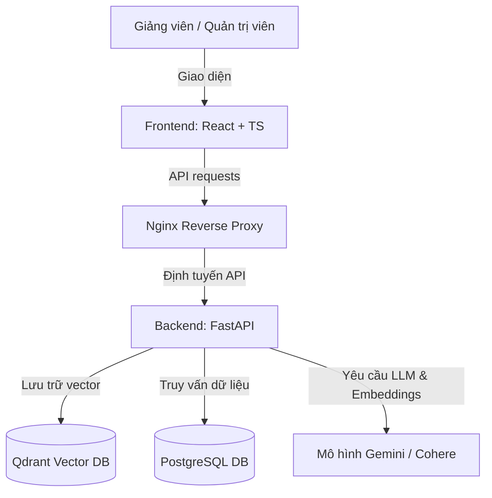

# Hệ Thống Hỗ Trợ Biên Soạn Bài Giảng RAG (RAG Teaching Material)

Hệ thống hỗ trợ giảng viên xây dựng bài giảng và ngân hàng câu hỏi trắc nghiệm tự động dựa trên tài liệu nguồn, ứng dụng kỹ thuật RAG (Retrieval-Augmented Generation) và mô hình ngôn ngữ lớn (LLM).

---

## 📌 Mục Tiêu Đồ Án
1. **Tự động hóa biên soạn giáo án**: Hỗ trợ giảng viên trích xuất tri thức từ tài liệu học tập (PDF/DOCX) để tạo dàn ý và nội dung bài giảng chi tiết một cách nhanh chóng.
2. **Sinh câu hỏi trắc nghiệm bám sát nguồn**: Hệ thống tự động truy xuất các đoạn tri thức liên quan từ tài liệu nguồn, sau đó sử dụng LLM để sinh câu hỏi trắc nghiệm, các phương án trả lời và đáp án đúng theo các mức độ nhận thức Bloom (Nhận biết, Thông hiểu, Vận dụng).
3. **Quản lý học liệu thông minh**: Cung cấp kho lưu trữ tài liệu dùng chung, tự động tách nhỏ văn bản (chunking) và nhúng vector (embedding) để phục vụ cho tìm kiếm ngữ nghĩa.
4. **Chuẩn hóa đầu ra**: Cho phép xuất giáo án và ngân hàng câu hỏi dưới các định dạng thông dụng như PDF, Word (DOCX) và CSV để dễ dàng nhập (import) vào các hệ thống quản lý học tập (LMS).

---

## ✨ Tính Năng Nổi Bật (Key Features)

Hệ thống cung cấp bộ giải pháp toàn diện hỗ trợ giảng viên biên soạn bài giảng và ngân hàng câu hỏi, chia thành các nhóm chức năng cốt lõi và các tính năng nâng cấp trải nghiệm người dùng:

### 🌟 Nhóm Chức năng Nghiệp vụ Cốt lõi
*   **Biên soạn Bài giảng Thông minh (AI-Powered Lecture Generation)**: Ứng dụng công nghệ RAG tiên tiến, tự động truy xuất kiến thức từ sách giáo trình tham khảo và tài liệu nguồn để hỗ trợ giảng viên viết chi tiết nội dung lý thuyết cho từng mục bài học theo thời gian thực.
*   **Sinh Ngân hàng Câu hỏi Trắc nghiệm (Quiz Generation)**: Tự động trích xuất kiến thức cốt lõi của bài học và gọi LLM để sinh câu hỏi trắc nghiệm khách quan (gồm đề bài, 4 phương án lựa chọn, đáp án đúng và lời giải thích ngắn) phân loại theo thang nhận thức Bloom (Nhận biết, Thông hiểu, Vận dụng).
*   **Kết xuất & Xuất bản Đa định dạng (Multi-Format Exporting)**: Cho phép tải bài giảng dưới dạng tài liệu Word (DOCX) hoặc PDF chuẩn hóa bố cục; xuất ngân hàng câu hỏi trắc nghiệm dưới dạng CSV hoặc **Moodle XML** để import trực tiếp vào các hệ thống LMS (Moodle, Canvas).
*   **Trợ lý Gợi ý Prompt chuyên biệt (Prompt Suggestions)**: Tích hợp hệ thống mẫu Prompt chuyên môn sư phạm (nhấp biểu tượng 🌟 Sparkles) để tự động điền các yêu cầu tối ưu cho AI theo 3 chế độ: *Soạn lý thuyết*, *Tạo ví dụ thực tế*, hoặc *Sinh câu hỏi thảo luận*.
*   **Tự động vẽ & Chèn sơ đồ minh họa (AI Image Generation)**: Cho phép chèn các sơ đồ 2D dạng vector mô tả cấu trúc hệ thống vào nội dung bài giảng thông qua cú pháp prompt ảnh. Hệ thống tích hợp bộ lọc **tự vá lỗi ảnh (Self-healing)** đảm bảo sơ đồ dựng lên sắc nét và chuẩn xác.

### ⚙️ Nhóm Tính năng Nâng cấp Trải nghiệm (UX/UI)
*   **Tổng hợp dàn ý hướng Sư phạm (Pedagogy-First Outline Synthesis)**: AI tự động phân tích toàn diện Đề cương môn học của trường (bao gồm Chuẩn đầu ra CLOs, Mục tiêu môn học, Lịch trình học) để tự động phân rã cấu trúc bài giảng Level 2, Level 3 bám sát lộ trình đào tạo của nhà trường trước khi tham chiếu giáo trình.
*   **Trình chỉnh sửa mục lục trực tiếp (Inline Outline Edit)**: Cho phép giảng viên bấm trực tiếp vào bất kỳ tiêu đề chương/mục con nào ngay tại màn hình phê duyệt mục lục để sửa tên nhanh, kéo thả sắp xếp lại thứ tự bài học trực quan.
*   **Chế độ Sửa & Đọc linh hoạt (Edit / Reader View Mode)**: Chuyển đổi linh hoạt giữa giao diện soạn thảo split-screen (vừa code Markdown vừa xem Preview) và chế độ đọc 100% toàn màn hình giúp giảng viên tập trung cao độ khi rà soát văn bản.
*   **Giao diện Nền tối toàn hệ thống (Dark/Light mode)**: Tích hợp nút chuyển đổi giao diện tối (Dark mode) đồng bộ toàn bộ trang web và trình soạn thảo (hỗ trợ `dark:prose-invert`), giúp giảm mỏi mắt cho giảng viên khi biên tập tài liệu về đêm.
*   **Bảo toàn trạng thái nháp (Chat Draft State Preservation)**: Hộp hội thoại chatbot RAG tự động lưu trữ tin nhắn nháp chưa gửi của giảng viên khi họ chuyển tab hoặc thực hiện các tác vụ khác mà không bị xóa mất dữ liệu.
*   **Cảnh báo an toàn sư phạm khi tạo Quiz**: Hệ thống hiển thị cảnh báo trực quan màu vàng ngăn chặn việc sinh câu hỏi trắc nghiệm từ các đề mục rỗng (chưa soạn nội dung lý thuyết), hướng dẫn giảng viên tạo bài giảng trước để đảm bảo tính chính xác của câu hỏi.

---

## 🏗️ Kiến Trúc Hệ Thống

Hệ thống được thiết kế theo kiến trúc 3 lớp (3-Tier Architecture) hiện đại, triển khai container hóa hoàn chỉnh:



*   **Frontend (React + TypeScript + Vite)**: Giao diện người dùng hiện đại, hiển thị trực quan giáo án và trình xem trước tài liệu song song (original & markdown).
*   **Backend (FastAPI)**: Cung cấp API hiệu năng cao cho việc xử lý tài liệu, quản lý phiên bản, kiểm soát phân quyền người dùng và tích hợp pipeline RAG.
*   **PostgreSQL**: Lưu trữ thông tin người dùng, lịch sử yêu cầu (usage logs) và metadata của tài liệu, cấu trúc bài giảng.
*   **Qdrant**: Cơ sở dữ liệu vector lưu trữ các vector embedding của các đoạn văn bản (chunks) phục vụ cho truy xuất ngữ nghĩa (Retrieval).
*   **Nginx**: Reverse proxy định tuyến các yêu cầu giữa Frontend và Backend.

---

## ⚙️ Các Phần Mềm Cần Thiết (Prerequisites)

Để triển khai dự án, máy tính của bạn cần cài đặt sẵn:
1.  **Docker & Docker Compose**: Để khởi chạy toàn bộ hệ thống bằng container.
2.  **Git**: Để tải và quản lý mã nguồn.
3.  **Trình duyệt Web**: Google Chrome, Microsoft Edge hoặc Mozilla Firefox.
4.  **Tài khoản Google Gemini API Key**: Cần thiết để sinh bài giảng và câu hỏi. Bạn có thể lấy khóa API miễn phí rất nhanh tại **[Google AI Studio](https://aistudio.google.com/)**.

---

## 📁 Tổ Chức Mã Nguồn (Repository Structure)

Toàn bộ mã nguồn và cấu hình của dự án được tổ chức gọn gàng bên trong thư mục `src/`:

```
AI_RAG_Project/
├── docs/                     # Tài liệu hướng dẫn đồ án
├── src/                      # Thư mục mã nguồn chính
│   ├── backend/              # Mã nguồn FastAPI
│   ├── frontend/             # Giao diện React
│   ├── nginx/                # Cấu hình Reverse Proxy Nginx
│   ├── scripts/              # Các kịch bản shell trợ giúp triển khai
│   ├── test/                 # Các kịch bản kiểm thử E2E (End-to-End)
│   ├── uploads/              # Lưu trữ tạm các tệp tài liệu upload
│   ├── .env.example          # Tệp cấu hình biến môi trường mẫu
│   ├── docker-compose.yml    # File Docker Compose môi trường Dev/Local
│   └── docker-compose.prod.yml # File Docker Compose môi trường Product
├── README.md                 # Tệp giới thiệu & hướng dẫn này
└── render.yaml               # Cấu hình triển khai Cloud (Render)
```

---

## 🚀 Hướng Dẫn Triển Khai Bằng Docker

Việc chạy hệ thống cực kỳ đơn giản nhờ Docker Compose. Vui lòng làm theo các bước dưới đây:

### Bước 1: Tải mã nguồn về máy (Clone Repository)
Mở cửa sổ Command Prompt / Terminal và chạy lệnh sau để tải toàn bộ mã nguồn của dự án:
```bash
git clone https://github.com/nguyentruongvu2/RAG_Teaching_Material.git
cd RAG_Teaching_Material
```

### Bước 2: Cấu hình biến môi trường
1.  Di chuyển vào thư mục `src/`:
    ```bash
    cd src
    ```
2.  Sao chép tệp cấu hình môi trường mẫu thành tệp cấu hình thực tế:
    ```bash
    cp .env.example .env
    ```
3.  Mở tệp `.env` vừa tạo và điền khóa API của bạn vào:
    *   `GEMINI_API_KEY`: Lấy khóa API Gemini miễn phí tại **[Google AI Studio](https://aistudio.google.com/)**.
    *   `COHERE_API_KEY`: *(Không bắt buộc)* Lấy khóa Rerank tại **[Cohere Dashboard](https://dashboard.cohere.com/)** (nếu để trống, hệ thống sẽ tự động dùng thuật toán nội bộ mà không báo lỗi).
    ```env
    GEMINI_API_KEY=your_gemini_api_key_here
    COHERE_API_KEY=your_cohere_api_key_here
    ```

### Bước 3: Khởi chạy các dịch vụ hệ thống
Tại thư mục `src/` (nơi chứa file `docker-compose.yml`), chạy lệnh sau để build và khởi động hệ thống:

```bash
docker compose up --build -d
```

Lệnh này sẽ tự động tải các Docker image cần thiết, thiết lập cơ sở dữ liệu PostgreSQL, cơ sở dữ liệu vector Qdrant, dịch vụ Backend, Frontend và liên kết chúng lại với nhau thông qua mạng ảo nội bộ.

### Bước 4: Kiểm tra trạng thái hoạt động
Đợi khoảng 30 giây đến 1 phút để các container khởi tạo xong. Bạn có thể kiểm tra trạng thái bằng lệnh:
```bash
docker compose ps
```
Nếu tất cả các container hiển thị trạng thái `running` hoặc `healthy`, hệ thống đã sẵn sàng hoạt động.

### Bước 5: Truy cập ứng dụng
*   **Giao diện ứng dụng (Frontend)**: Truy cập qua trình duyệt tại địa chỉ [http://localhost:3000](http://localhost:3000)
*   **Tài liệu API (Swagger UI)**: Truy cập tại địa chỉ [http://localhost:8000/docs](http://localhost:8000/docs)
*   **Cơ sở dữ liệu Vector Qdrant Console**: Truy cập tại địa chỉ [http://localhost:6333/dashboard](http://localhost:6333/dashboard)

### Bước 6: Dừng hệ thống
Để tắt tất cả các container mà không làm mất dữ liệu của cơ sở dữ liệu, chạy lệnh:
```bash
docker compose down
```
Nếu muốn xóa toàn bộ container và xóa sạch volume dữ liệu (reset database), hãy chạy:
```bash
docker compose down -v
```

---

## 👥 Tài Khoản Mặc Định Đăng Nhập
Hệ thống hỗ trợ 2 loại tài khoản mẫu sau khi khởi tạo dữ liệu:
*   **Tài khoản Giảng viên (User)**: Email: `teacher@local.test` / Mật khẩu: `teacher123`
*   **Tài khoản Quản trị viên (Admin)**: Email: `admin@local.test` / Mật khẩu: `admin123`
