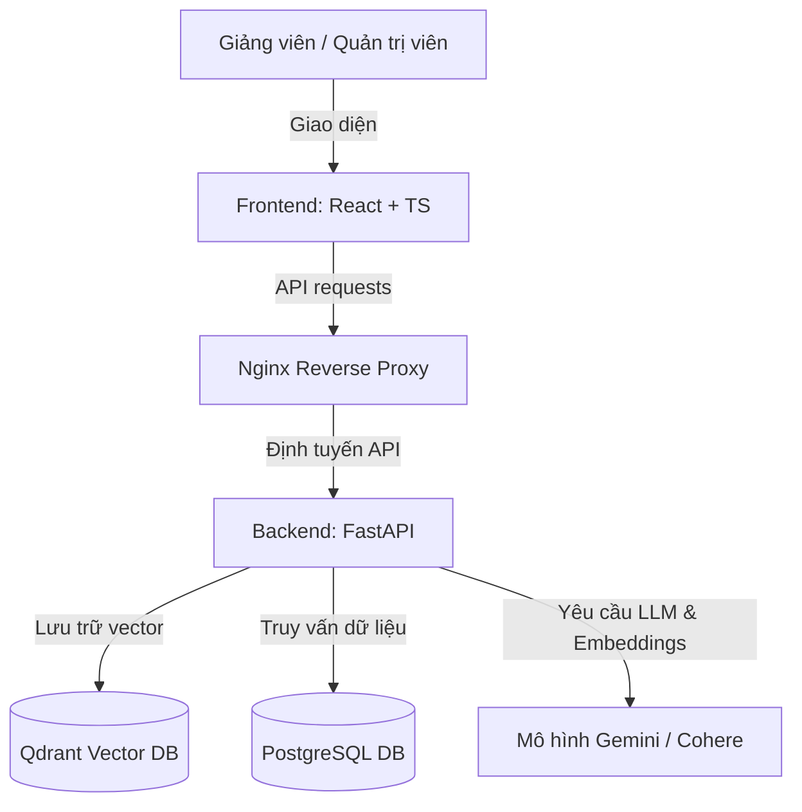

# Hệ Thống Hỗ Trợ Biên Soạn Bài Giảng RAG (RAG Teaching Material)

Hệ thống hỗ trợ giảng viên xây dựng bài giảng và ngân hàng câu hỏi trắc nghiệm tự động dựa trên tài liệu nguồn, ứng dụng kỹ thuật RAG (Retrieval-Augmented Generation) và mô hình ngôn ngữ lớn (LLM).

---

## 📌 Mục Tiêu Đồ Án
1. **Tự động hóa biên soạn giáo án**: Hỗ trợ giảng viên trích xuất tri thức từ tài liệu học tập (PDF/DOCX) để tạo dàn ý và nội dung bài giảng chi tiết một cách nhanh chóng.
2. **Sinh câu hỏi trắc nghiệm bám sát nguồn**: Hệ thống tự động truy xuất các đoạn tri thức liên quan từ tài liệu nguồn, sau đó sử dụng LLM để sinh câu hỏi trắc nghiệm, các phương án trả lời và đáp án đúng theo các mức độ nhận thức Bloom (Nhận biết, Thông hiểu, Vận dụng).
3. **Quản lý học liệu thông minh**: Cung cấp kho lưu trữ tài liệu dùng chung, tự động tách nhỏ văn bản (chunking) và nhúng vector (embedding) để phục vụ cho tìm kiếm ngữ nghĩa.
4. **Chuẩn hóa đầu ra**: Cho phép xuất giáo án và ngân hàng câu hỏi dưới các định dạng thông dụng như PDF, Word (DOCX) và CSV để dễ dàng nhập (import) vào các hệ thống quản lý học tập (LMS).

---

## 🏗️ Kiến Trúc Hệ Thống

Hệ thống được thiết kế theo kiến trúc 3 lớp (3-Tier Architecture) hiện đại, triển khai container hóa hoàn chỉnh:



*   **Frontend (React + TypeScript + Vite)**: Giao diện người dùng hiện đại, hiển thị trực quan giáo án và trình xem trước tài liệu song song (original & markdown).
*   **Backend (FastAPI)**: Cung cấp API hiệu năng cao cho việc xử lý tài liệu, quản lý phiên bản, kiểm soát phân quyền người dùng và tích hợp pipeline RAG.
*   **PostgreSQL**: Lưu trữ thông tin người dùng, lịch sử yêu cầu (usage logs) và metadata của tài liệu, cấu trúc bài giảng.
*   **Qdrant**: Cơ sở dữ liệu vector lưu trữ các vector embedding của các đoạn văn bản (chunks) phục vụ cho truy xuất ngữ nghĩa (Retrieval).
*   **Nginx**: Reverse proxy định tuyến các yêu cầu giữa Frontend và Backend.

---

## ⚙️ Các Phần Mềm Cần Thiết (Prerequisites)

Để triển khai dự án, máy tính của bạn cần cài đặt sẵn:
1.  **Docker & Docker Compose**: Để khởi chạy toàn bộ hệ thống bằng container.
2.  **Git**: Để tải và quản lý mã nguồn.
3.  **Trình duyệt Web**: Google Chrome, Microsoft Edge hoặc Mozilla Firefox.
4.  **Tài khoản Google Gemini API Key**: Cần thiết để hệ thống gọi LLM sinh nội dung bài giảng và câu hỏi trắc nghiệm.

---

## 📁 Tổ Chức Mã Nguồn (Repository Structure)

Toàn bộ mã nguồn và cấu hình của dự án được tổ chức gọn gàng bên trong thư mục `src/`:

```
AI_RAG_Project/
├── docs/                     # Tài liệu hướng dẫn đồ án
├── src/                      # Thư mục mã nguồn chính
│   ├── backend/              # Mã nguồn FastAPI
│   ├── frontend/             # Giao diện React
│   ├── nginx/                # Cấu hình Reverse Proxy Nginx
│   ├── scripts/              # Các kịch bản shell trợ giúp triển khai
│   ├── test/                 # Các kịch bản kiểm thử E2E (End-to-End)
│   ├── uploads/              # Lưu trữ tạm các tệp tài liệu upload
│   ├── .env.example          # Tệp cấu hình biến môi trường mẫu
│   ├── docker-compose.yml    # File Docker Compose môi trường Dev/Local
│   └── docker-compose.prod.yml # File Docker Compose môi trường Product
├── README.md                 # Tệp giới thiệu & hướng dẫn này
└── render.yaml               # Cấu hình triển khai Cloud (Render)
```

---

## 🚀 Hướng Dẫn Triển Khai Bằng Docker

Việc chạy hệ thống cực kỳ đơn giản nhờ Docker Compose. Vui lòng làm theo các bước dưới đây:

### Bước 1: Cấu hình biến môi trường
1.  Di chuyển vào thư mục `src/`:
    ```bash
    cd src
    ```
2.  Sao chép tệp cấu hình môi trường mẫu thành tệp cấu hình thực tế:
    ```bash
    cp .env.example .env
    ```
3.  Mở tệp `.env` vừa tạo và điền khóa API của bạn vào:
    ```env
    GEMINI_API_KEY=your_gemini_api_key_here
    COHERE_API_KEY=your_cohere_api_key_here
    ```

### Bước 2: Khởi chạy các dịch vụ hệ thống
Tại thư mục `src/` (nơi chứa file `docker-compose.yml`), chạy lệnh sau để build và khởi động hệ thống:

```bash
docker compose up --build -d
```

Lệnh này sẽ tự động tải các Docker image cần thiết, thiết lập cơ sở dữ liệu PostgreSQL, cơ sở dữ liệu vector Qdrant, dịch vụ Backend, Frontend và liên kết chúng lại với nhau thông qua mạng ảo nội bộ.

### Bước 3: Kiểm tra trạng thái hoạt động
Đợi khoảng 30 giây đến 1 phút để các container khởi tạo xong. Bạn có thể kiểm tra trạng thái bằng lệnh:
```bash
docker compose ps
```
If tất cả các container hiển thị trạng thái `running` hoặc `healthy`, hệ thống đã sẵn sàng hoạt động.

### Bước 4: Truy cập ứng dụng
*   **Giao diện ứng dụng (Frontend)**: Truy cập qua trình duyệt tại địa chỉ [http://localhost:3000](http://localhost:3000)
*   **Tài liệu API (Swagger UI)**: Truy cập tại địa chỉ [http://localhost:8000/docs](http://localhost:8000/docs)
*   **Cơ sở dữ liệu Vector Qdrant Console**: Truy cập tại địa chỉ [http://localhost:6333/dashboard](http://localhost:6333/dashboard)

### Bước 5: Dừng hệ thống
Để tắt tất cả các container mà không làm mất dữ liệu của cơ sở dữ liệu, chạy lệnh:
```bash
docker compose down
```
Nếu muốn xóa toàn bộ container và xóa sạch volume dữ liệu (reset database), hãy chạy:
```bash
docker compose down -v
```

---

## 👥 Tài Khoản Mặc Định Đăng Nhập
Hệ thống hỗ trợ 2 loại tài khoản mẫu sau khi khởi tạo dữ liệu:
*   **Tài khoản Giảng viên (User)**: `teacher` / Mật khẩu: `teacher123`
*   **Tài khoản Quản trị viên (Admin)**: `admin` / Mật khẩu: `admin123`
